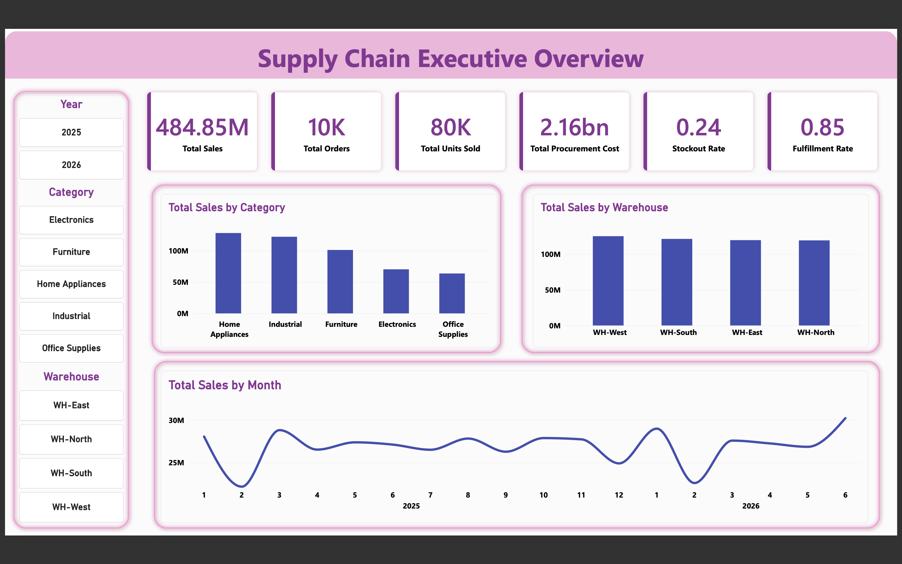
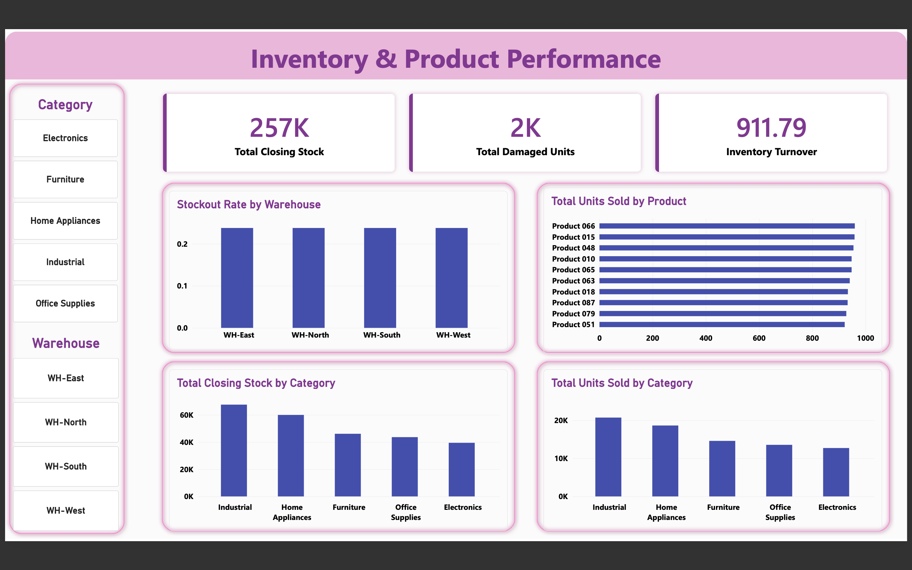
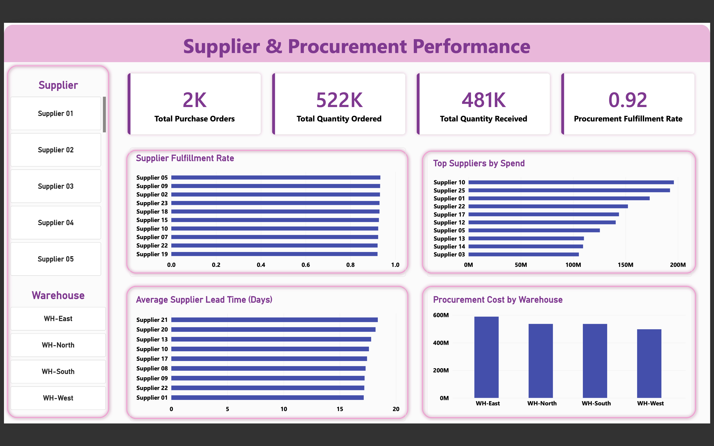

# Supply Chain & Inventory Analytics

## 📊 Data Analyst Portfolio Project

An end-to-end Supply Chain & Inventory Analytics project analyzing inventory, products, orders, suppliers, procurement, warehouses, stockouts, fulfillment, and supplier performance using Python, Pandas, MySQL, Excel, Power BI, and DAX.

---

## 🎯 Project Overview

The objective of this project is to transform supply chain and operational data into actionable business insights.

The project covers:

- Inventory performance
- Product performance
- Sales and order analysis
- Warehouse performance
- Stockout analysis
- Supplier performance
- Procurement analysis
- Procurement costs
- Supplier lead time
- Late deliveries
- Fulfillment performance

### Project Workflow

Python/Pandas
      ↓
Data Cleaning
      ↓
Feature Engineering
      ↓
Excel
      ↓
MySQL Business Analysis
      ↓
Power BI
      ↓
DAX Measures
      ↓
Interactive Dashboard
      ↓
Business Insights

---

## 🛠️ Tools & Technologies

| Tool | Purpose |
| ----------- | ------------------------------------- |
| Python | Data analysis and transformation |
| Pandas | Data cleaning and feature engineering |
| Excel | Data preparation and reporting |
| MySQL | Business analysis and SQL queries |
| Power BI | Interactive dashboard |
| DAX | Dynamic KPI calculations |

---

## 📊 Dataset Overview

| Dataset | Raw Rows | Cleaned Rows |
| -------- | -------- | ------------ |
| Products | 100 | 100 |
| Suppliers | 25 | 25 |
| Inventory | 1,600 | 1,600 |
| Orders | 10,000 | 9,489 |
| Procurement | 2,000 | 1,988 |

The reduction in Orders and Procurement records is due to duplicate records removed during the Python data-cleaning process.

---

## 📈 Key KPIs

| KPI | Description |
| -------- | -------- |
| Total Sales | Total sales generated from customer orders |
| Total Orders | Number of customer orders |
| Total Units Sold | Total quantity sold |
| Closing Stock | Total inventory closing stock |
| Stockout Rate | Percentage of inventory records with stockouts |
| Inventory Turnover | Measures inventory movement efficiency |
| Fulfillment Rate | Percentage of orders successfully fulfilled |
| Procurement Fulfillment Rate | Quantity received compared with quantity ordered |
| Average Lead Time | Average number of days between PO date and actual delivery |
| Late Delivery Rate | Percentage of procurement orders delivered after expected date |
| Procurement Cost | Total procurement expenditure |

---

## 📊 Power BI Dashboard

The final Power BI report contains three interactive pages.

### Page 1 — Supply Chain Executive Overview

Key metrics and analysis:

- Total Sales
- Total Orders
- Total Units Sold
- Total Procurement Cost
- Stockout Rate
- Fulfillment Rate
- Monthly Sales Trend
- Sales by Category
- Sales by Warehouse
- Year, Warehouse, and Category slicers

### Dashboard Screenshot

---

### Page 2 — Inventory & Product Performance

Key metrics and analysis:

- Total Closing Stock
- Total Damaged Units
- Inventory Turnover
- Stockout Rate by Warehouse
- Top 10 Products by Units Sold
- Closing Stock by Category
- Units Sold by Category
- Warehouse and Category slicers

### Dashboard Screenshot

---

### Page 3 — Supplier & Procurement Performance

Key metrics and analysis:

- Total Purchase Orders
- Total Quantity Ordered
- Total Quantity Received
- Procurement Fulfillment Rate
- Supplier Fulfillment Rate
- Top Suppliers by Procurement Spend
- Average Supplier Lead Time
- Late Delivery Rate by Supplier
- Procurement Cost by Warehouse
- Monthly Procurement Cost Trend
- Warehouse slicer

### Dashboard Screenshot

---

## 🧮 DAX Measures

### Total Purchase Orders

Total Purchase Orders =
DISTINCTCOUNT(Procurement[procurement_id])

### Total Quantity Ordered

Total Quantity Ordered =
SUM(Procurement[quantity_ordered])

### Total Quantity Received

Total Quantity Received =
SUM(Procurement[quantity_received])

### Procurement Fulfillment Rate

Procurement Fulfillment Rate =
DIVIDE(
    [Total Quantity Received],
    [Total Quantity Ordered],
    0
)

### Average Lead Time

Average Lead Time =
AVERAGEX(
    Procurement,
    DATEDIFF(
        Procurement[po_date],
        Procurement[actual_delivery_date],
        DAY
    )
)

### Late Deliveries

Late Deliveries =
CALCULATE(
    COUNTROWS(Procurement),
    Procurement[actual_delivery_date] >
    Procurement[expected_delivery_date]
)

### Late Delivery Rate

Late Delivery Rate =
DIVIDE(
    [Late Deliveries],
    [Total Purchase Orders],
    0
)

---

## 🗄️ MySQL Database

Database: supply_chain

### Tables

- suppliers
- products
- inventory
- orders
- procurement

MySQL was used for:

- Inventory analysis
- Product analysis
- Order analysis
- Supplier analysis
- Procurement analysis
- Warehouse analysis
- Stockout analysis
- Fulfillment analysis
- Lead-time analysis
- Late-delivery analysis

---

## 🧹 Data Cleaning & Analysis

Python/Pandas was used for:

- Data inspection
- Data cleaning
- Duplicate removal
- Data type handling
- Missing/inconsistent data handling
- Date preparation
- Feature engineering
- KPI preparation
- Exporting cleaned datasets

MySQL was used for:

- Business analysis
- Aggregations
- Supplier analysis
- Inventory analysis
- Procurement analysis
- Product analysis
- Order analysis
- Warehouse analysis
- KPI calculations

---

## 📗 Excel

The cleaned datasets were consolidated into an Excel workbook containing:

- Products
- Suppliers
- Inventory
- Orders
- Procurement

Output file:

output/Supply_Chain_Analytics.xlsx

---

## 💡 Key Business Insights

### 1. Inventory and Stockout Risk

The dashboard helps identify warehouses and inventory areas experiencing higher stockout activity.

### 2. Product Demand Analysis

Product-level sales and inventory analysis helps identify high-demand products and products requiring closer inventory monitoring.

### 3. Supplier Performance

Supplier fulfillment rate and procurement performance help identify suppliers that consistently meet or fall short of ordered quantities.

### 4. Supplier Lead Time

Average supplier lead time helps identify suppliers that require longer delivery periods and supports better procurement planning.

### 5. Late Deliveries

Late Delivery Rate highlights suppliers and procurement activities where actual delivery occurs after the expected delivery date.

### 6. Procurement Spending

Procurement cost analysis helps identify warehouses and suppliers with higher procurement expenditure.

### 7. Warehouse Performance

Warehouse-level analysis helps compare inventory, sales, stockouts, and procurement activity across different locations.

### 8. Fulfillment Performance

Order and procurement fulfillment metrics provide visibility into how efficiently customer orders and procurement requirements are being completed.

---

## 💼 Business Recommendations

- Monitor warehouses with higher stockout rates.
- Improve replenishment planning for high-demand products.
- Maintain appropriate safety-stock levels.
- Evaluate suppliers based on fulfillment performance.
- Investigate suppliers with consistently high lead times.
- Investigate suppliers with high late-delivery rates.
- Monitor procurement spending by warehouse.
- Improve procurement planning using historical demand patterns.
- Prioritize high-demand products to reduce stockout risk.
- Use supplier performance metrics during procurement decisions.

---

## 📁 Project Structure

Supply_Chain_Inventory_Analytics/
│
├── README.md
│
├── raw_data/
│   ├── products.csv
│   ├── suppliers.csv
│   ├── inventory.csv
│   ├── orders.csv
│   └── procurement.csv
│
├── cleaned_data/
│   ├── products_cleaned.csv
│   ├── suppliers_cleaned.csv
│   ├── inventory_cleaned.csv
│   ├── orders_cleaned.csv
│   └── procurement_cleaned.csv
│
├── python/
│   └── project.py
│
├── sql/
│   └── supply_chain_analysis.sql
│
├── output/
│   └── Supply_Chain_Analytics.xlsx
│
└── screenshots/
    ├── executive_overview.png
    ├── inventory_product.png
    └── supplier_procurement.png

---

## 🚀 Future Improvements

- Demand forecasting
- Inventory demand prediction
- Supplier risk scoring
- ABC inventory analysis
- Safety-stock optimization
- Reorder-point optimization
- Machine Learning for demand forecasting
- Automated data pipelines
- Advanced supply chain forecasting

---

## 🏁 Conclusion

This project demonstrates a complete Data Analyst workflow from raw operational data to business decision-making.

It demonstrates practical skills in:

Python | Pandas | SQL | MySQL | Excel | Power BI | DAX | Data Visualization | Supply Chain Analytics | Business Analytics

---

## 👨‍💻 Author

Raj Kumar Mehta

Data Analyst Portfolio Project
